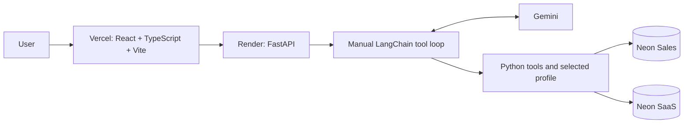

# Agentic Data Analyst

Ask analytical questions in natural language and get answers grounded in PostgreSQL
query results. A ReAct-style agent discovers relational schemas, inspects metadata,
and generates and executes guarded read-only SQL through an explicit LangChain
tool-calling loop, demonstrated on synthetic Sales and SaaS databases.

**Live demo:** [Open Agentic Data Analyst](https://agentic-data-analyst-nine.vercel.app)

**Backend:** `https://agentic-data-analyst-api.onrender.com` ·
[Health](https://agentic-data-analyst-api.onrender.com/health) ·
[Readiness](https://agentic-data-analyst-api.onrender.com/ready)

Both production datasets have been verified end-to-end by the maintainer.
The backend root is not the demo page; use the frontend to ask questions.
See the [short demo walkthrough](docs/demo.md).

## Technology

| Layer | Technologies |
| --- | --- |
| Agent and tools | Python, LangChain, Gemini, Psycopg 3 |
| HTTP backend | FastAPI |
| Local tool interoperability | Official Python MCP SDK, stdio |
| Relational data | PostgreSQL, Neon |
| Frontend | React, TypeScript, Vite, Tailwind CSS |
| Hosting | Render backend, Vercel frontend |
| Engineering tooling | Docker backend packaging and optional local container execution |

## Why this project exists

The engineering challenge is moving beyond a text-to-SQL demo with a known schema
and broad database privileges. This project focuses on runtime schema discovery,
restricted query execution, self-correction, schema generalization, deterministic
evaluation, and a deployed user-facing demo.

The agent mechanics stay visible: tool binding, Python dispatch, observations,
and stopping conditions are implemented directly rather than hidden in a framework.

## How it works

```text
User question → Gemini → get_schema / describe_table → SQL generation
→ execute_sql → PostgreSQL → ToolMessage → Gemini final response
```

This is a typical database question flow, not a forced sequence. Gemini chooses
which tools it needs and can revise SQL after an error or inspect categorical
values before applying a filter. The explicit loop in [app/agent.py](app/agent.py)
handles every requested tool call, preserves its `tool_call_id`, and permits at
most eight model responses, including the final answer. The core agent is a manual
LangChain tool loop; it does not use LangGraph.

## Core capabilities

- Dynamic discovery of public base tables and their columns.
- PK/FK, default, nullability, and PostgreSQL semantic-comment inspection.
- Read-only analytical SQL generation and SQL-error self-correction.
- Grounding unknown categorical filter values in metadata or bounded value queries.
- Bounded execution with a statement timeout and result row cap.
- Isolated Sales/SaaS database profile selection per request.
- Structured local traces, timing, safe errors, and bounded result previews.
- Deterministic database-result evaluation and a second-schema generalization suite.

| Tool | Responsibility |
| --- | --- |
| `calculator` | Explicit addition, subtraction, multiplication, and division |
| `get_schema` | Discover public base tables, column names, and data types |
| `describe_table` | Inspect columns, primary/foreign keys, defaults, and semantic comments |
| `execute_sql` | Execute one guarded read-only analytical SELECT or supported WITH query |

## MCP interface

The safe analytical data layer is also available to local MCP-compatible clients:

```text
Web: Vercel -> FastAPI -> Agent -> tools -> PostgreSQL
MCP: MCP client -> stdio MCP server -> same safe data/tool layer -> PostgreSQL
```

The web Agent does not use MCP internally. The independent server exposes
`list_database_profiles`, `get_schema`, `describe_table`, and `execute_sql`.
Database operations require an explicit `sales` or `saas` profile and reuse the
existing connection context and read-only tools. MCP does not require Gemini.

From the repository root, with Conda `llm` activated and requirements installed:

```powershell
python -m app.mcp_server --help
python -m pytest -q tests/test_mcp_server.py -p no:cacheprovider
# Configure your MCP client to launch:
python -m app.mcp_server
```

The launch command waits for protocol input; let the client manage the subprocess.
There is no public MCP endpoint or deployment change. Client templates, profile
settings, safety, and limitations: [docs/mcp.md](docs/mcp.md).

## Safety model

The project uses defense in depth:

1. Model/tool instructions require schema grounding and factual database results.
2. SQL validation permits one SELECT or supported WITH statement and rejects common writes/DDL.
3. Query execution sets the PostgreSQL transaction to `READ ONLY`.
4. Runtime role `analyst_agent` has SELECT-only table grants and no write privileges.
5. A **5,000 ms statement timeout** bounds query execution.
6. At most **100 result rows** are returned, with truncation reported.

**PostgreSQL role permissions are the final permission boundary.** The SQL text
checks are guardrails, not a complete SQL parser or proof that every query is safe.
Connection attempts also have a five-second timeout. Credentials remain in server
environment configuration and are never sent to Gemini or exposed to the browser.
Only the two predefined synthetic datasets are publicly selectable; arbitrary
user database connections and write operations are unsupported.

## Cross-database generalization

The same core manual agent loop and four tools were evaluated across two distinct
PostgreSQL schemas, using runtime discovery rather than a separate SaaS agent:

| Dataset | Tables |
| --- | --- |
| Sales | `customers`, `products`, `orders`, `order_items`, `sales` |
| SaaS | `accounts`, `plans`, `subscriptions`, `invoices`, `support_tickets` |

The SaaS suite was introduced as an unseen second database. Relationships and
business units come from real PK/FK constraints and PostgreSQL comments; the
profile configuration selects a connection destination, not a schema-specific
SQL template. This demonstrates generalization across these two fixtures, not
reliability on every future database.

## Evaluation

Official recorded live benchmark baselines:

| Dataset | Cases | Passed | Accuracy |
| --- | ---: | ---: | ---: |
| Sales | 24 | 22 | **91.67%** |
| SaaS unseen | 16 | 14 | **87.50%** |

Evaluation is deterministic, not an LLM judge. The agent receives only each
natural-language question; reference SQL and expected results stay evaluator-only.
Reference results were verified against PostgreSQL. The runner selects supporting
SQL from the agent trace, re-executes it read-only, and compares structured results
using explicit contracts for requested fields, ordering, numeric tolerance, and
other declared representation rules.

These are limited synthetic-data benchmarks. Known failures include model/provider
interruptions and convergence or result-representation issues. Diagnostic rescoring
is not a new live benchmark and does not replace the official numbers above.
No 100% accuracy or universal text-to-SQL reliability is claimed.

Details: [Sales evaluation](eval/README.md) ·
[SaaS evaluation](eval/generalization/README.md) ·
[Architecture and evaluation path](docs/architecture.md#evaluation-and-observability).

## Production architecture



Vercel hosts the frontend; Render runs the source-based Python backend; Neon
hosts separate Sales and SaaS databases. Each request selects one allowlisted
profile. Docker is retained for consistent backend packaging and optional local
verification; it is not required for the current Render deployment.

## Repository structure

```text
app/                   Agent, tools, FastAPI, stdio MCP, configuration, database, traces
frontend/              React/TypeScript/Vite demo and mocked frontend tests
tests/                 Mocked unit tests and separate PostgreSQL integration tests
eval/                  Sales/SaaS cases, deterministic runners, offline rescoring
sql/                   Reproducible dataset, metadata, role, and verification scripts
docs/                  Architecture, demo, deployment, tracing, and MCP guides
Dockerfile             Optional backend container runtime
.dockerignore          Strict backend build-context allowlist
.env.example           Environment names and safe placeholders
requirements.txt       Existing backend Python dependencies
.python-version        Backend Python pin
render.yaml            Source-based Render backend configuration
```

Generated traces (`runs/`), evaluation reports, migration exports, local env files,
and build output remain Git ignored. Benchmark definitions remain version-controlled.

## Local development

### Requirements

- Python 3.10+; use the existing Conda environment `llm` (no `.venv`).
- Node.js 24 LTS recommended; frontend requires Node 22.12 or newer.
- For local database queries, provision the synthetic PostgreSQL fixtures and a
  read-only `analyst_agent` role, or supply the existing restricted hosted URLs.
  The legacy 300-row sales source creation is not scripted in this repository.

### Backend

From the repository root:

```powershell
conda activate llm
python -m pip install -r requirements.txt
if (!(Test-Path .env)) { Copy-Item .env.example .env }
uvicorn app.api:app --reload
```

Fill the local `.env` privately before running real queries. Set browser origins
to match the frontend dev server; process environment values override dotenv.
Never commit a populated env file or use an owner/superuser URL for runtime access.

| Environment variable names | Purpose |
| --- | --- |
| `GOOGLE_API_KEY` | Gemini server credential |
| `DATABASE_SALES_URL`, `DATABASE_SAAS_URL` | Separate restricted hosted profile destinations |
| `DB_HOST`, `DB_PORT`, `DB_NAME`, `DB_USER`, `DB_PASSWORD` | Supported local PostgreSQL fallback; DB_NAME remains the CLI/eval default |
| `ALLOWED_ORIGINS` | Explicit comma-separated browser origins |
| `TRACE_ENABLED`, `TRACE_DIR` | Optional local trace persistence and directory |

Hosted profile URLs override local fallback settings. HTTP clients submit only
`sales` or `saas`; the server resolves the actual destination. CLI/evaluation
retain their existing local configuration unless explicitly scoped otherwise.

### Frontend

In a second terminal:

```powershell
cd frontend
if (!(Test-Path .env)) { Copy-Item .env.example .env }
npm ci
npm run dev
```

Open `http://localhost:5173`. `VITE_API_BASE_URL` is the sole browser environment
setting. It is public: never put Gemini keys or database credentials in frontend
configuration. See [deployment setup](docs/deployment.md) for hosted CORS and URLs.

### Tests and local traces

Tests include offline fake-model/fake-connection checks **and live local PostgreSQL
integration tests**. A full suite requires the local Sales fixture; optional SaaS
integration tests also require its fixture. No automated Python test calls Gemini.

```powershell
python -m pytest -q tests
# Optional SaaS integration checks, only when database access is intended:
$env:RUN_GENERALIZATION_DB_TESTS = "1"
python -m unittest discover -s tests -v
```

Frontend verification:

```powershell
cd frontend
npm run test
npm run build
```

Inspect local trace evidence without model/database calls:

```powershell
python -m app.trace --latest
```

Production file traces are disabled; local tracing supports redaction and bounded
previews. See [docs/tracing.md](docs/tracing.md). Merely selecting a live demo
example fills the form; submitting a question invokes Gemini and consumes quota.

## Deployment overview

- **Neon:** two isolated synthetic PostgreSQL datasets with restricted `analyst_agent` runtime access.
- **Render:** FastAPI source deployment, Gemini key and separate database URLs supplied privately at runtime.
- **Vercel:** static Vite build with a public API base URL; backend CORS allows the exact frontend origin.
- **Docker:** backend packaging for optional local/container verification and future portability.

Production Sales and SaaS queries are maintainer-verified. This documentation
phase did not repeat live queries, benchmarks, or cloud changes. The $0/month
infrastructure target remains subject to provider allowances, usage, and model quota.
Operational instructions: [docs/deployment.md](docs/deployment.md).

## Known limitations

- Temperature 0 does not make external LLM behavior fully deterministic.
- Provider failures and rate limits can interrupt a run; there are no automatic provider retries.
- Render Free instances may cold start after inactivity ([service lifecycle](https://render.com/docs/free)).
- Benchmarks cover only the synthetic Sales/SaaS datasets; arbitrary production-schema accuracy is not guaranteed.
- The agent can reach its eight-response limit before finalizing an answer.
- Evaluation SQL selection and representation contracts have known limitations.
- No write operations, authentication, sessions, streaming, or arbitrary database connections are supported.
- Production tracing has no durable storage; readiness checks configuration, not connectivity or provider quota.
- Docker files are implemented, but local image/runtime verification is still pending from the unavailable Docker engine.

## Future work

Planned, not implemented:

- MCP client interoperability/demo after review (local server implemented).
- A larger schema/generalization benchmark.
- Richer observability with an appropriate durable storage strategy.
- Optional model-provider abstraction when justified by a real use case.
