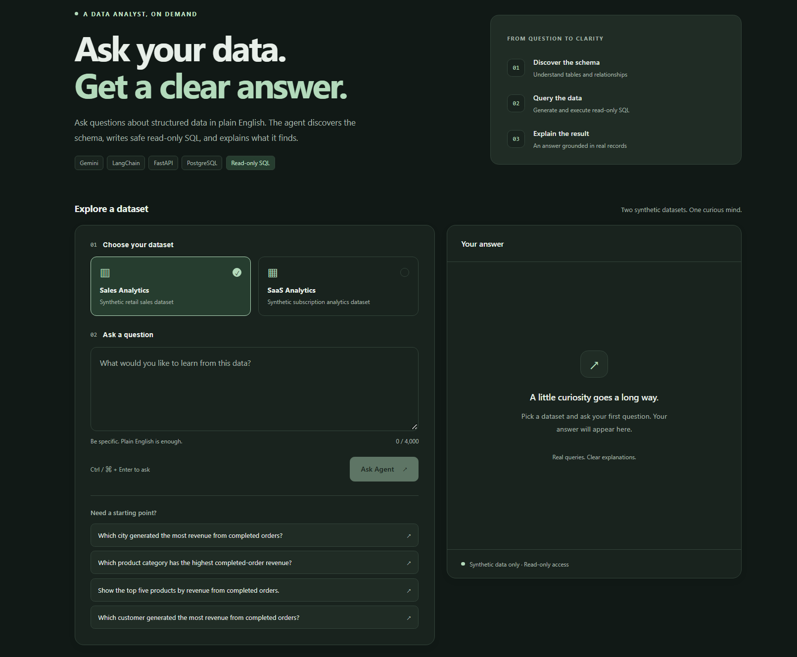
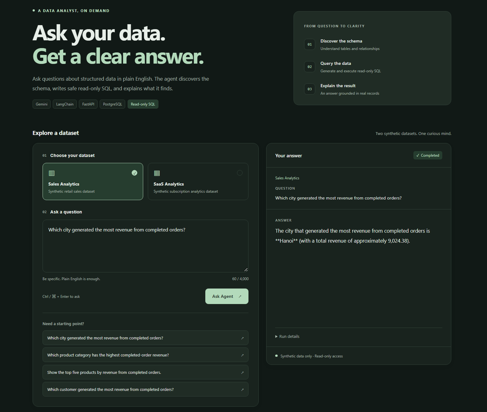
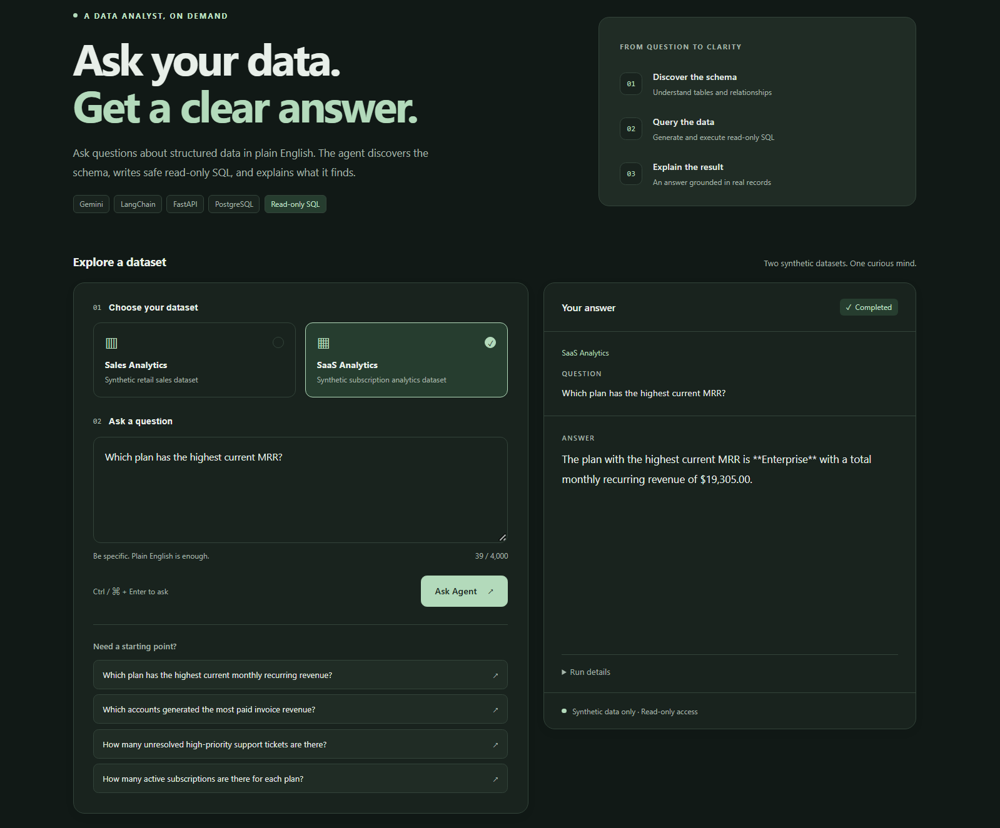
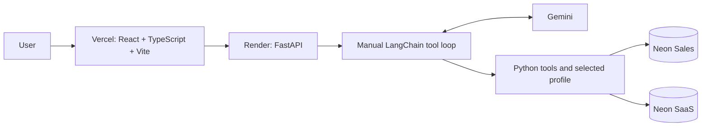
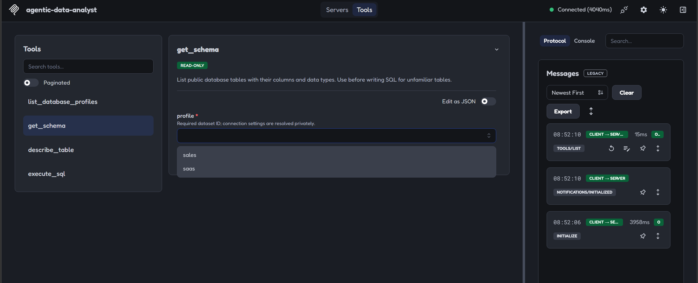
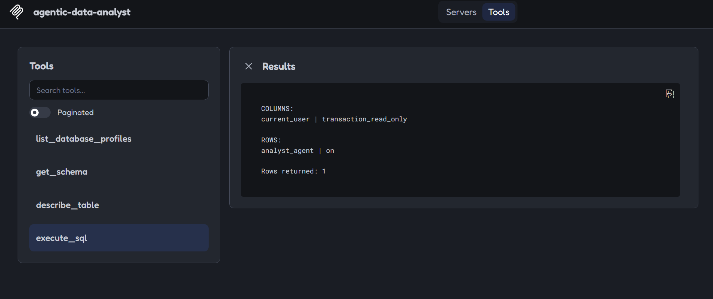

# Agentic Data Analyst

<a id="why-this-project-exists"></a>

An **AI Engineering** portfolio project: a deployed natural-language analytics
system where Gemini and a manual LangChain tool-calling loop discover schemas,
generate SQL, correct errors, and answer from PostgreSQL through guarded tools.
The core contribution is agent orchestration and safe external-system interaction.

**Live demo:** [Open Agentic Data Analyst](https://agentic-data-analyst-nine.vercel.app)

**Backend:** `https://agentic-data-analyst-api.onrender.com` ·
[Health](https://agentic-data-analyst-api.onrender.com/health) ·
[Readiness](https://agentic-data-analyst-api.onrender.com/ready)

Both production datasets have been verified end-to-end by the maintainer.
The backend root is not the demo page; use the frontend to ask questions.
See the [short demo walkthrough](docs/demo.md).

**v1.0.0 released.** See the [release notes](docs/release-notes-v1.0.0.md)
and [release checklist](docs/release-checklist.md).

**Sales: 22/24 = 91.67% · SaaS unseen: 14/16 = 87.50%.**

[AI capabilities](#core-capabilities) · [Architecture](#architecture) · [AI Engineering Stack](#ai-engineering-stack) ·
[Tools](#agent-tools) · [SQL safety](#safety-model) · [Evaluation](#evaluation) · [Local setup](#local-development)

<a id="demo"></a>

## Demo

<p align="center">
  <a href="docs/assets/web-overview.png"></a>
  <br>Production web interface with Sales Analytics selected.
</p>

Real production screenshots supplied by the maintainer. Select an image to view
it at full size; these examples do not replace the official benchmark scores.

<table>
  <tr>
    <td width="50%" valign="top">
      <a href="docs/assets/sales-query.png"></a><br>
      <strong>Sales analytics</strong><br>
      Completed-order revenue by city, answered in natural language.
    </td>
    <td width="50%" valign="top">
      <a href="docs/assets/saas-query.png"></a><br>
      <strong>SaaS analytics</strong><br>
      The same core agent on a different PostgreSQL schema: current MRR by plan.
    </td>
  </tr>
</table>

<a id="core-capabilities"></a>

## Key AI Capabilities

- Dynamic discovery of public base tables and their columns.
- PK/FK, default, nullability, and PostgreSQL semantic-comment inspection.
- Read-only analytical SQL generation and SQL-error self-correction.
- Grounding unknown categorical filter values in metadata or bounded value queries.
- Bounded execution with a statement timeout and result row cap.
- Isolated Sales/SaaS database profile selection per request.
- Structured local traces, timing, safe errors, and bounded result previews.
- Deterministic database-result evaluation and a second-schema generalization suite.

<a id="architecture"></a>

## System Architecture



Vercel hosts the frontend; Render runs the source-based Python backend; Neon
hosts separate Sales and SaaS databases. Each request selects one allowlisted
profile. Docker is retained for consistent backend packaging and optional local
verification; it is not required for the current Render deployment.

```text
Web: Vercel frontend -> FastAPI -> manual LangChain Agent -> safe tools -> PostgreSQL
MCP: MCP client -> local stdio MCP server -> same safe data layer -> PostgreSQL
```

The web Agent does not use MCP internally. The local MCP interface requires no
Gemini and is not publicly hosted.

<a id="how-it-works"></a>

## How the Agent Works

```text
User question → Gemini → get_schema / describe_table → SQL generation
→ execute_sql → PostgreSQL → ToolMessage → Gemini final response
```

This is a typical database question flow, not a forced sequence. Gemini chooses
which tools it needs and can revise SQL after an error or inspect categorical
values before applying a filter. The explicit loop in [app/agent.py](app/agent.py)
handles every requested tool call, preserves its `tool_call_id`, and permits at
most eight model responses, including the final answer. The core agent is a manual
LangChain tool loop; it does not use LangGraph.

1. Bind tool schemas with `bind_tools()` and begin with SystemMessage/HumanMessage.
2. Invoke Gemini, append its AIMessage, then dispatch every requested tool in order.
3. Validate arguments, execute Python tools, and append each matching ToolMessage.
4. Invoke again to use observations, correct a request, or answer; stop after at
   most eight model responses. Binding exposes schemas; Python executes tools.

<a id="technology"></a>
<a id="ai-engineering-stack"></a>

## AI Engineering Stack

The stack is organized around the responsibilities of an AI system. The core
engineering work is model/tool orchestration, schema grounding, constrained data
access, error correction, evaluation, and serving the agent through an API.

### LLM & Agentic AI

| Technology / Concept | Role in this project |
| --- | --- |
| Google Gemini | `gemini-3.5-flash-lite`, temperature 0: selects tools, generates SQL, interprets observations, and synthesizes the final answer |
| LangChain | `@tool` definitions, `bind_tools()`, input schemas, and Human/AI/Tool messages |
| Tool Calling | The model requests tools and arguments; Python validates and executes each request |
| Manual Agent / Tool Execution Loop | Explicit message state, registry dispatch, matching `tool_call_id`, and stopping conditions; no prebuilt agent or LangGraph |
| Prompt / Tool Orchestration | System instructions require schema grounding, verified categorical values, trusted business comments, and successful query evidence |
| Self-Correction | SQL errors, rejected queries, unknown tools, and argument-schema errors become observations for revision within the response budget; no provider retries |
| MCP Interface | Independent official-SDK stdio server over the same safe tools; the web agent does not use MCP internally |

### AI Tools & Data Analysis

| Component | Responsibility |
| --- | --- |
| PostgreSQL Schema Discovery | `get_schema` discovers public base tables; `describe_table` supplies columns, PK/FK relationships, defaults, and semantic comments |
| SQL Generation & Safe Execution | Gemini generates analytical SQL; `execute_sql` validates and executes it under read-only protections |
| Python Arithmetic Tool | `calculator` performs explicit add/subtract/multiply/divide operations; no general Python execution or dataframe analysis tool is exposed |
| Database Profile Routing | `resolve_profile()` and scoped database context isolate the selected Sales/SaaS destination per run |
| Tool Observations | Metadata and SQL column/row text return through matching ToolMessages; database result text is not a typed row API |

### AI Safety & Guardrails

| Safeguard | Implemented boundary |
| --- | --- |
| SQL Restrictions | One SELECT or supported WITH; reject common write/DDL forms and multiple statements |
| Database Enforcement | READ ONLY transaction plus restricted `analyst_agent` role; permissions are the final boundary |
| Execution Bounds | 5,000 ms SQL timeout, five-second connection timeout, at most 100 returned rows |
| Agent Response Limit | At most eight model responses including the final answer; multiple tool calls may occur in one response |
| Secret / Error Handling | Environment-based credentials, centralized redaction, and controlled failure messages |

These layers constrain interaction with external systems while letting the model
choose the necessary tools. SQL text checks are guardrails, not a complete parser.

### AI Backend

| Technology / Component | Role |
| --- | --- |
| Python | Manual agent core, registry dispatch, tools, connection context, and traces |
| FastAPI | Stateless HTTP service reusing the existing agent through `/query` |
| Pydantic | Request/response models, allowed-field/profile validation, and tool argument-schema validation |
| Execution Model | Synchronous agent/Psycopg work in FastAPI's worker pool; MCP uses async protocol IO and a worker thread for database tools |
| API Endpoints | `/health`, `/ready`, `/databases`, and `/query`; safe errors and run linkage |

### Data Layer

| Technology / Dataset | Role |
| --- | --- |
| PostgreSQL + Psycopg 3 | Relational metadata, analytical queries, scoped connections, and database permission enforcement |
| Neon | Separate hosted synthetic Sales and SaaS PostgreSQL databases |
| Sales Profile | Retail tables and normalized customers/products/orders/order_items; original sales retained |
| SaaS Profile | Accounts, plans, subscriptions, invoices, and support tickets; a second schema for generalization |
| Dynamic Routing | Only `sales`/`saas` are public selections; hosted URLs override local fallback privately, without per-request environment mutation |

### Evaluation & Observability

| Component | Purpose |
| --- | --- |
| Deterministic Evaluation | Separate 24-case Sales and 16-case SaaS suites; question-only agent input and evaluator-only PostgreSQL reference results |
| Supporting SQL Selection | Ground-truth-free heuristic selects successful SQL for read-only re-execution and explicit result comparison |
| Structured Local Tracing | Model turns, tool/SQL calls, IDs, status, timing, final answers, and bounded redacted previews in Git-ignored `runs/` |
| Error Classification | Separates model integration, argument validation, SQL rejection/execution, tool runtime, database, and response-limit failures |
| Trace Reader / Offline Rescore | Inspect saved traces or rescore saved evidence without Gemini/database calls; no LangSmith or OpenTelemetry platform is used |

### Deployment & Infrastructure

| Component | Role / status |
| --- | --- |
| Render | Source-based Python/FastAPI production backend with `/health` checks; file tracing disabled |
| Neon | Two managed PostgreSQL projects using restricted runtime access |
| Vercel | Hosts the frontend for the deployed AI service |
| Environment Configuration | Gemini key, restricted database URLs, explicit CORS origins, and optional local trace settings |
| Docker | Backend packaging, non-root runtime configuration, PORT handling, and liveness healthcheck; image/runtime verification remains pending |
| Deployment Workflow | Manual deployment; no CI/CD or GitHub Actions workflow is configured |

### Client / UI

| Technology | Role |
| --- | --- |
| React + TypeScript + Vite + Tailwind CSS | Dataset selection, example questions, typed API calls, answers, and safe errors for the AI service |

The frontend is the interface to the AI system. Agent reasoning, tool execution,
and database access run on the backend.

### Tech Stack Summary

| AI Engineering Area | Stack |
| --- | --- |
| LLM | Google Gemini |
| Agent Tooling | LangChain |
| Agent Architecture | Manual tool-calling loop, SQL/argument self-correction |
| AI Tools | Schema discovery, metadata inspection, read-only SQL, Python calculator |
| Guardrails | SELECT/WITH restrictions, READ ONLY, analyst_agent, time/row/response limits |
| Backend | Python, FastAPI, Pydantic |
| Data | PostgreSQL, Psycopg 3, Neon; Sales/SaaS profiles |
| Evaluation / Observability | Deterministic reference-result evaluation, structured local traces, safe failure classification |
| AI Interface | Independent MCP / local stdio |
| Deployment | Render, Neon, Vercel; optional Docker packaging |
| Client / UI | React, TypeScript, Vite, Tailwind CSS |

<a id="agent-tools"></a>

## Agent Tools

| Tool | Responsibility |
| --- | --- |
| `calculator` | Explicit addition, subtraction, multiplication, and division |
| `get_schema` | Discover public base tables, column names, and data types |
| `describe_table` | Inspect columns, primary/foreign keys, defaults, and semantic comments |
| `execute_sql` | Execute one guarded read-only analytical SELECT or supported WITH query |

Tools return metadata/SQL text or a calculator number, then observations reach
the model through ToolMessages. No arbitrary Python execution tool is exposed.

<a id="mcp-interface"></a>

### Independent MCP interface

The safe analytical data layer is also available to local MCP-compatible clients.

The web Agent does not use MCP internally. The independent server exposes
`list_database_profiles`, `get_schema`, `describe_table`, and `execute_sql`.
Database operations require an explicit `sales` or `saas` profile and reuse the
existing connection context and read-only tools. MCP does not require Gemini.

From the repository root, with Conda `llm` activated and requirements installed:

```powershell
python -m app.mcp_server --help
python -m pytest -q tests/test_mcp_server.py -p no:cacheprovider
# Configure your MCP client to launch:
python -m app.mcp_server
```

The launch command waits for protocol input; let the client manage the subprocess.
There is no public MCP endpoint or deployment change. Client templates, profile
settings, safety, and limitations: [docs/mcp.md](docs/mcp.md).

The web application is the human-facing natural-language Agent; MCP is the
machine-facing read-only tool interface. The user verified MCP interoperability
with Inspector 2.9.0: both live datasets, schema/table metadata, analyst_agent in
READ ONLY transactions, Sales count 300, SaaS subscriptions count 120, and write
rejection. No Gemini was involved. See the [verified MCP demo](docs/mcp-demo.md).

<p align="center">
  <a href="docs/assets/mcp-tools.png"></a>
</p>

MCP Inspector discovering the four read-only analytical tools.

<p align="center">
  <a href="docs/assets/mcp-readonly-security.png"></a>
</p>

MCP query result: `current_user = analyst_agent` and `transaction_read_only = on`.
This screenshot shows the runtime role and transaction setting; write rejection
is recorded separately in the verified walkthrough above.

<a id="safety-model"></a>

## SQL Safety & Guardrails

The project uses defense in depth:

1. Model/tool instructions require schema grounding and factual database results.
2. SQL validation permits one SELECT or supported WITH statement and rejects common writes/DDL.
3. Query execution sets the PostgreSQL transaction to `READ ONLY`.
4. Runtime role `analyst_agent` has SELECT-only table grants and no write privileges.
5. A **5,000 ms statement timeout** bounds query execution.
6. At most **100 result rows** are returned, with truncation reported.

**PostgreSQL role permissions are the final permission boundary.** The SQL text
checks are guardrails, not a complete SQL parser or proof that every query is safe.
Connection attempts also have a five-second timeout. Credentials remain in server
environment configuration and are never sent to Gemini or exposed to the browser.
Only the two predefined synthetic datasets are publicly selectable; arbitrary
user database connections and write operations are unsupported.

The loop also bounds model responses to eight, including the final answer;
this is not an eight-tool-call limit. A response can request several tools.

<a id="error-recovery"></a>

## Error Recovery / Self-Correction

The manual loop feeds SQL errors and rejected queries back as ToolMessage
observations. System instructions require revised SQL before retrying and targeted
schema inspection when needed. Argument-schema validation failures return safe
field/type feedback with the matching tool_call_id so Gemini can repair the call.
Unknown tools also return observations; arguments are never silently renamed.

Unexpected tool runtime exceptions and database/model failures stop with controlled
errors. This is bounded semantic correction, not a blanket retry policy: there
are no automatic provider retries. The eight-response limit includes the final
answer, and sufficient successful evidence should lead to a conclusion.

<a id="official-benchmarks"></a>
<a id="evaluation"></a>

## Evaluation & Observability

| Dataset | Cases | Passed | Accuracy |
| --- | ---: | ---: | ---: |
| Sales | 24 | 22 | **91.67%** |
| SaaS unseen | 16 | 14 | **87.50%** |

Recorded live results on two synthetic fixtures, scored deterministically against
PostgreSQL reference results. These are limited benchmark scores, not a guarantee
for every live answer.

The official recorded baselines above are unchanged.

Evaluation is deterministic, not an LLM judge. The agent receives only each
natural-language question; reference SQL and expected results stay evaluator-only.
Reference results were verified against PostgreSQL. The runner selects supporting
SQL from the agent trace, re-executes it read-only, and compares structured results
using explicit contracts for requested fields, ordering, numeric tolerance, and
other declared representation rules.

These are limited synthetic-data benchmarks. Known failures include model/provider
interruptions and convergence or result-representation issues. Diagnostic rescoring
is not a new live benchmark and does not replace the official numbers above.
No 100% accuracy or universal text-to-SQL reliability is claimed.

Details: [Sales evaluation](eval/README.md) ·
[SaaS evaluation](eval/generalization/README.md) ·
[Architecture and evaluation path](docs/architecture.md#evaluation-and-observability).

### Structured local traces

[app/trace.py](app/trace.py) records model turns, tool-call IDs/arguments, SQL,
timing, safe status/error categories, and final answers. Optional persistence uses
atomic JSON writes under Git-ignored `runs/`, with at most 10 SQL row lines and
4,000 preview characters. Configured secrets are redacted; no hidden reasoning
or raw provider objects are captured. Persistence failure does not replace an answer.
Render disables file persistence; run IDs remain, with null trace_path. The
frontend discards server trace paths. No durable production trace store is implemented.

[eval/rescore.py](eval/rescore.py) supports offline rescoring without Gemini or
PostgreSQL calls. It does not produce new model responses or replace live scores.
See [the tracing guide](docs/tracing.md) for the reader and trace schema.

<a id="backend-api"></a>

## Backend API

[app/api.py](app/api.py) serves the existing agent as a stateless backend service.

| Endpoint | Responsibility |
| --- | --- |
| `GET /health` | Process liveness; no Gemini/database call |
| `GET /ready` | Configuration readiness only, not live connectivity or quota |
| `GET /databases` | Public Sales/SaaS display metadata, never connection settings |
| `POST /query` | Validated question and database profile; grounded answer or safe error with run linkage |

Pydantic validates questions of 1–4,000 characters and allowlisted profiles;
extra request fields are rejected. The synchronous handler runs the blocking
agent in FastAPI's worker pool. Each request uses isolated database context, not
environment mutation. Explicit-origin CORS is configured without credentials or
wildcards; it does not replace authentication or PostgreSQL permissions.
No sessions, conversational persistence, or streaming are implemented.

<a id="cross-database-generalization"></a>
<a id="database-profiles"></a>

## Database Profiles

The same core manual agent loop and four tools were evaluated across two distinct
PostgreSQL schemas, using runtime discovery rather than a separate SaaS agent:

| Dataset | Tables |
| --- | --- |
| Sales | `customers`, `products`, `orders`, `order_items`, `sales` |
| SaaS | `accounts`, `plans`, `subscriptions`, `invoices`, `support_tickets` |

The SaaS suite was introduced as an unseen second database. Relationships and
business units come from real PK/FK constraints and PostgreSQL comments; the
profile configuration selects a connection destination, not a schema-specific
SQL template. This demonstrates generalization across these two fixtures, not
reliability on every future database.

Server-side [app/profiles.py](app/profiles.py) maps `sales` to local
`agentic_analyst` and `saas` to `agentic_analyst_saas`. In production, separate
Neon URLs override those local targets. Context resets after the run; clients
cannot supply arbitrary hosts, URLs, or credentials.

<a id="deployment-overview"></a>

## Deployment

- **Neon:** two isolated synthetic PostgreSQL datasets with restricted `analyst_agent` runtime access.
- **Render:** FastAPI source deployment, Gemini key and separate database URLs supplied privately at runtime.
- **Vercel:** static Vite build with a public API base URL; backend CORS allows the exact frontend origin.
- **Docker:** backend packaging for optional local/container verification and future portability.

Production Sales and SaaS queries are maintainer-verified. This documentation
phase did not repeat live queries, benchmarks, or cloud changes. The $0/month
infrastructure target remains subject to provider allowances, usage, and model quota.
Operational instructions: [docs/deployment.md](docs/deployment.md).

<a id="repository-structure"></a>

## Project Structure

```text
app/                   Agent, tools, FastAPI, stdio MCP, configuration, database, traces
frontend/              React/TypeScript/Vite demo and mocked frontend tests
tests/                 Mocked unit tests and separate PostgreSQL integration tests
eval/                  Sales/SaaS cases, deterministic runners, offline rescoring
sql/                   Reproducible dataset, metadata, role, and verification scripts
docs/                  Architecture, demo, deployment, tracing, MCP, and release guides
Dockerfile             Optional backend container runtime
.dockerignore          Strict backend build-context allowlist
.env.example           Environment names and safe placeholders
requirements.txt       Existing backend Python dependencies
.python-version        Backend Python pin
render.yaml            Source-based Render backend configuration
```

Generated traces (`runs/`), evaluation reports, migration exports, local env files,
and build output remain Git ignored. Benchmark definitions remain version-controlled.

<a id="local-development"></a>

## Local Setup

<a id="requirements"></a>

### Requirements

- Python 3.10+; use the existing Conda environment `llm` (no `.venv`).
- Node.js 24 LTS recommended; frontend requires Node 22.12 or newer.
- For local database queries, provision the synthetic PostgreSQL fixtures and a
  read-only `analyst_agent` role, or supply the existing restricted hosted URLs.
  The legacy 300-row sales source creation is not scripted in this repository.

### Backend

From the repository root:

```powershell
conda activate llm
python -m pip install -r requirements.txt
if (!(Test-Path .env)) { Copy-Item .env.example .env }
uvicorn app.api:app --reload
```

Fill the local `.env` privately before running real queries. Set browser origins
to match the frontend dev server; process environment values override dotenv.
Never commit a populated env file or use an owner/superuser URL for runtime access.

### Frontend

In a second terminal:

```powershell
cd frontend
if (!(Test-Path .env)) { Copy-Item .env.example .env }
npm ci
npm run dev
```

Open `http://localhost:5173`. `VITE_API_BASE_URL` is the sole browser environment
setting. It is public: never put Gemini keys or database credentials in frontend
configuration. See [deployment setup](docs/deployment.md) for hosted CORS and URLs.

<a id="tests-and-local-traces"></a>

### Tests and local traces

Tests include offline fake-model/fake-connection checks **and live local PostgreSQL
integration tests**. A full suite requires the local Sales fixture; optional SaaS
integration tests also require its fixture. No automated Python test calls Gemini.

```powershell
python -m pytest -q tests
# Optional SaaS integration checks, only when database access is intended:
$env:RUN_GENERALIZATION_DB_TESTS = "1"
python -m unittest discover -s tests -v
```

Frontend verification:

```powershell
cd frontend
npm run test
npm run build
```

Inspect local trace evidence without model/database calls:

```powershell
python -m app.trace --latest
```

Production file traces are disabled; local tracing supports redaction and bounded
previews. See [docs/tracing.md](docs/tracing.md). Merely selecting a live demo
example fills the form; submitting a question invokes Gemini and consumes quota.

<a id="environment-variables"></a>

## Environment Variables

| Environment variable names | Purpose |
| --- | --- |
| `GOOGLE_API_KEY` | Gemini server credential |
| `DATABASE_SALES_URL`, `DATABASE_SAAS_URL` | Separate restricted hosted profile destinations |
| `DB_HOST`, `DB_PORT`, `DB_NAME`, `DB_USER`, `DB_PASSWORD` | Supported local PostgreSQL fallback; DB_NAME remains the CLI/eval default |
| `ALLOWED_ORIGINS` | Explicit comma-separated browser origins |
| `TRACE_ENABLED`, `TRACE_DIR` | Optional local trace persistence and directory |

Hosted profile URLs override local fallback settings. HTTP clients submit only
`sales` or `saas`; the server resolves the actual destination. CLI/evaluation
retain their existing local configuration unless explicitly scoped otherwise.

<a id="known-limitations"></a>

## Limitations

- Temperature 0 does not make external LLM behavior fully deterministic.
- Provider failures and rate limits can interrupt a run; there are no automatic provider retries.
- Render Free instances may cold start after inactivity ([service lifecycle](https://render.com/docs/free)).
- Benchmarks cover only the synthetic Sales/SaaS datasets; arbitrary production-schema accuracy is not guaranteed.
- The agent can reach its eight-response limit before finalizing an answer.
- Evaluation SQL selection and representation contracts have known limitations.
- No write operations, authentication, sessions, streaming, or arbitrary database connections are supported.
- Production tracing has no durable storage; readiness checks configuration, not connectivity or provider quota.
- Docker files are implemented, but local image/runtime verification is still pending from the unavailable Docker engine.

<a id="optional-future-work"></a>

## Future Improvements

No further architecture changes are planned for v1.0. These ideas are optional,
not release requirements:

- A larger schema/generalization benchmark.
- Richer observability with an appropriate durable storage strategy.
- Optional model-provider abstraction when justified by a real use case.

Portfolio evidence: [recommended real screenshots and captions](docs/portfolio.md).

<a id="license"></a>

## License

No LICENSE file is currently included in the repository. This README does not
assign an open-source license.
