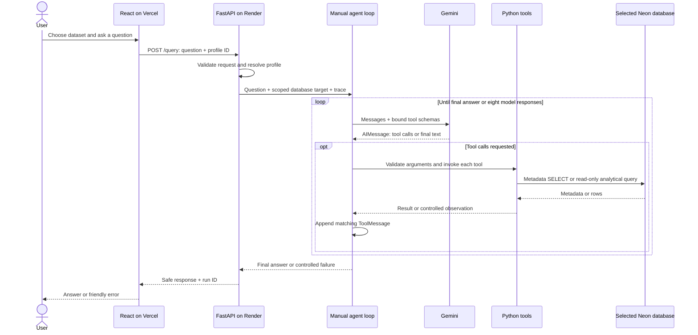
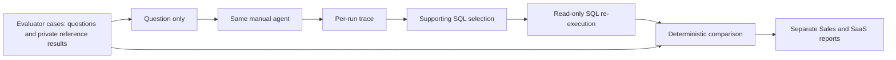

# Architecture

The project makes the agent's mechanics explicit: Gemini chooses LangChain tools,
Python executes them, and the model observes results before answering. The core
is a manual ReAct-style tool-calling workflow in `app/agent.py`, without LangGraph
or a prebuilt SQL agent. The API and frontend reuse that same core.

## Request path

The diagram's database branch applies to metadata/SQL tools; `calculator` runs
locally without PostgreSQL. The model can request several tools in one response,
and the loop dispatches each in order. It is not forced through a fixed sequence.

`app/api.py` validates questions of 1–4,000 characters and only `sales`/`saas`
profile IDs; additional request fields are rejected. Its synchronous query handler
runs through FastAPI's worker pool. `/databases` exposes display metadata, not
credentials. `/health` is liveness, and `/ready` validates configuration without
contacting Gemini or PostgreSQL. They do not prove live connectivity or quota.

## Manual agent loop

1. `get_llm()` creates the Gemini chat model; `bind_tools(TOOLS)` supplies the four
   tools' names, descriptions, and argument schemas. Binding does not execute tools.
2. The message list starts with `SystemMessage` instructions and a `HumanMessage`.
3. An invocation returns an `AIMessage`. Append it before any tool observations:
   it contains the requests that those observations answer.
4. For every `response.tool_calls` entry, look up the registry entry by name,
   validate the arguments, and call the LangChain tool's `.invoke(arguments)`.
5. Append `ToolMessage(content=result, tool_call_id=call["id"])`. The exact ID
   associates each result with its request, including multiple calls in one turn.
6. Invoke Gemini again with the expanded list so it can use the result, request
   more tools, correct an error, or produce the final answer.
7. A response without tool calls supplies the final answer. The default limit is
   eight model responses, including the final response; exceeding it stops the run.

SQL rejection/execution errors are tool observations rather than invented results.
Argument-schema errors return declared-field feedback with the same tool-call ID,
allowing repair on a later turn. Unknown tool names also become observations.
Unexpected failures inside tools, connection failures, or provider integration
errors terminate with controlled error handling. There are no provider retries.

Conversation state belongs only to this invocation. Local trace persistence is
observability, not conversational memory, and is not replayed into later requests.
No hidden chain-of-thought is requested or recorded.

## Tool responsibilities

| Tool | Inputs | Source and result |
| --- | --- | --- |
| `calculator` | `operation`, `a`, `b` | Explicit arithmetic; no eval or database access |
| `get_schema` | None | `information_schema` public BASE TABLES; ordered table/column/type listing |
| `describe_table` | `table_name` | Parameterized catalog lookups; column order, nullability, defaults, PostgreSQL comments, PK/FK metadata |
| `execute_sql` | `query` | One guarded SELECT/supported WITH; column names, bounded rows, row count, truncation or short error observation |

Metadata is discovered at runtime, without hard-coded table lists in the tools.
`describe_table` combines information_schema with PostgreSQL catalogs; ordered
primary-key metadata is accessible to the restricted role, including composite
keys. Semantic column comments ground business units, such as fractional discount
rates, rather than relying on a column's name alone.

Categorical filters are grounded in trusted metadata or targeted bounded value
queries. An unverified literal producing zero matches needs inspection before a
no-match conclusion; an already grounded zero result remains valid. Schema
inspection is targeted to the question rather than repeated for every table.

## Database profile isolation

`app/profiles.py` separates safe public metadata from connection destinations:

| Profile | Hosted setting | Local fallback |
| --- | --- | --- |
| `sales` | `DATABASE_SALES_URL` | `agentic_analyst` |
| `saas` | `DATABASE_SAAS_URL` | `agentic_analyst_saas` |

The API resolves the allowlisted profile server-side. A ContextVar scopes its
database target to one run and resets in `finally`; concurrent requests do not
change process environment variables. Tools reuse `get_connection()` to reach
that target. Hosted URLs are passed natively to Psycopg, preserving SSL options;
the code does not require a pooled or direct hostname pattern.

Profile selection supplies connection routing, not table names, relationships,
SQL templates, or evaluator reference answers. Gemini learns those analytical
details from catalog observations. The same core loop and tools support both
schemas. HTTP clients cannot supply arbitrary names, hosts, credentials, or URLs.
CLI/evaluation defaults retain their existing environment-based configuration.

## Defense in depth

| Layer | Mechanism and boundary |
| --- | --- |
| Model instructions | Require grounding, successful query evidence, and correction of observed errors |
| SQL guardrails | One SELECT/supported WITH; reject common writes, DDL, and multiple statements |
| Transaction | `SET TRANSACTION READ ONLY` before analytical SQL |
| Runtime permissions | `analyst_agent`: read-only grants, no ownership/admin memberships or writes |
| Time bound | 5,000 ms statement timeout; five-second connection timeout |
| Output bound | Fetch at most 101 rows to detect truncation; return at most 100 |

The SQL validation is a text-based guardrail, not a full parser or security
boundary. PostgreSQL role permissions are the final permission boundary, with
READ ONLY providing an independent transaction check. Database administrators
perform migrations separately; the runtime never uses owner credentials.

Secrets stay in backend environment configuration. They are not included in
model messages or public dataset metadata. CORS uses explicit origins without
wildcards or credentials; it does not replace authentication or database grants.
The demo intentionally exposes only two synthetic datasets and has no auth,
sessions, streaming, write tools, or arbitrary user database connections.

## Evaluation and observability

`eval/cases.json` and `eval/generalization/cases.json` contain evaluator-only
reference SQL and PostgreSQL-verified expected results. The live runners send
only question text to the agent. `eval/selection.py` selects supporting successful
SQL using saved observations, the question, and final-answer evidence, without
reference answers. The runner re-executes it read-only and applies explicit
comparison contracts: scalar/table shape, requested columns, alias treatment,
row ordering, numeric tolerance, and declared temporal/ranked matching rules.
The score is not an LLM judgment of answer wording.

Official live baselines remain Sales **22/24 (91.67%)** and unseen SaaS
**14/16 (87.50%)**. Two synthetic fixtures provide limited generalization evidence;
provider failures, convergence misses, and evaluator representation/selection
limitations affect interpretation. Offline rescoring is separately labeled and
does not replace these recorded live scores.

`app/trace.py` records per-run model/tool/SQL timing, IDs, safe statuses/errors,
bounded result previews, optional allowlisted numeric token usage, and operation
metrics. When enabled, atomic JSON files are saved to Git-ignored `runs/` or the
configured TRACE_DIR. Results are limited to 10 SQL row lines and 4,000 preview
characters; configured secrets are redacted. Raw provider objects, exception
messages, credentials, and evaluator ground truth are excluded from agent traces.

Render configuration disables production file persistence. In-memory run IDs
remain available; trace_path is null when persistence is disabled or fails.
The frontend discards server trace paths and does not display internal traces.
Local persistence failure does not replace an answer. No durable cloud trace
store, public trace reader, or additional model/database calls are introduced.
See [tracing.md](tracing.md) for the trace format and read-only CLI reader.

## Deployment boundary

Vercel serves the frontend, Render runs FastAPI from source, and two Neon databases
provide separate synthetic fixtures under restricted runtime access. Docker
packages the backend for optional local execution and portability; it is not
required by the selected source-based Render deployment. See [deployment.md](deployment.md).

Production end-to-end Sales and SaaS verification is maintainer-reported. This
documentation phase does not repeat live requests, database queries, or benchmarks.
